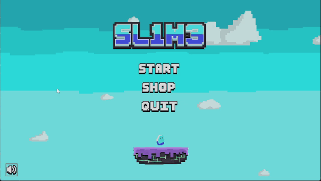
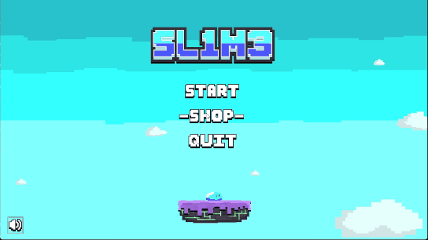

# SL1M3

<p align="center">
  <b>A 2D platformer where the game deletes itself as you play.</b>
  <br />
  <i>Built with a Custom C++ Engine & Lua Scripting</i>
</p>

---

## 📸 Media & Demo

<table align="center">
  <tr>
    <td align="center"><b>Main Menu</b></td>
    <td align="center"><b>Customization Shop</b></td>
    <td align="center"><b>Gameplay</b></td>
  </tr>
  <tr>
    <td></td>
    <td></td>
    <td></td>
  </tr>
</table>

---

## 🎮 The Concept

In **SL1M3**, survival is a race against time and data corruption. Players must navigate an endless sequence of increasingly difficult levels while a **constantly advancing laser** erases the world behind them. 

The catch? The game is "deleting itself" as you progress. Move fast, or be erased.

---

## 🛠️ Technical Implementation

This project was developed for a Software Engineering course, focusing on the interface between low-level engine architecture and high-level gameplay scripting.

* **Custom C++ Engine:** Game Engine provided by DAE.
* **Lua-C++ Bindings:** I wrote the bridge between the engine and the script, allowing the C++ core to execute high-level Lua logic.
* **Gameplay Scripting:** 100% of the game logic—including player movement, level triggers, and the "deletion" mechanic—was written by me in Lua.
* **Systems Design:** Created a functional **Shop System** for purchasing skins and a modular hazard system (jump pads, teleporters, lasers).

---

## 🎨 Art & Assets
I served as the sole technical artist for this project, creating:
* Original 2D sprite work for the slime and environment.
* UI/UX design for the menu and shop interfaces.
* Visual effects (VFX) for mechanical interactions like teleporting.

---

## 🚀 How to Run
> **Note:** This project was built for Windows/OpenGL.

   ```bash
   Game/LuaGameEngine.exe
